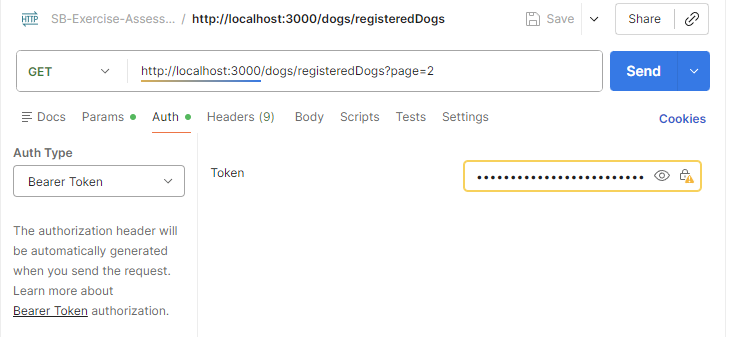
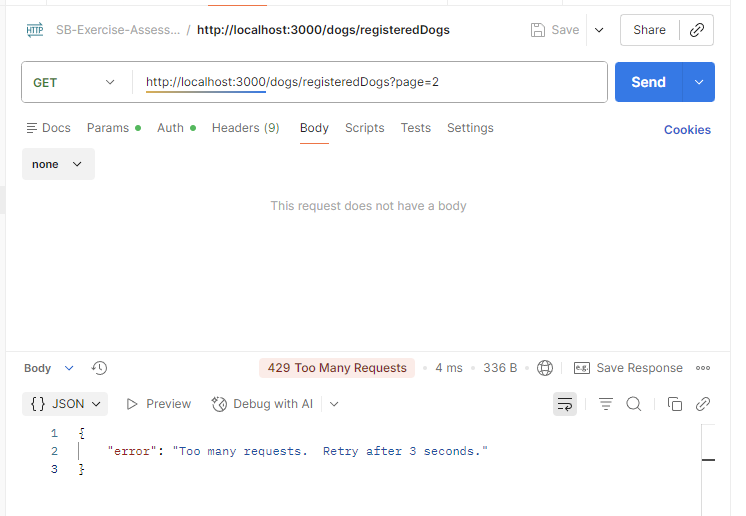
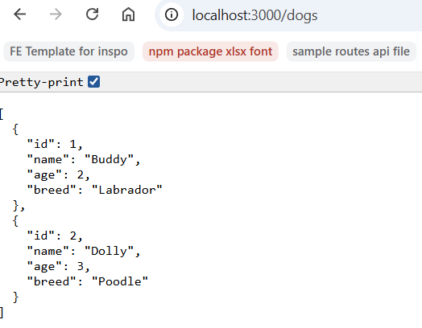
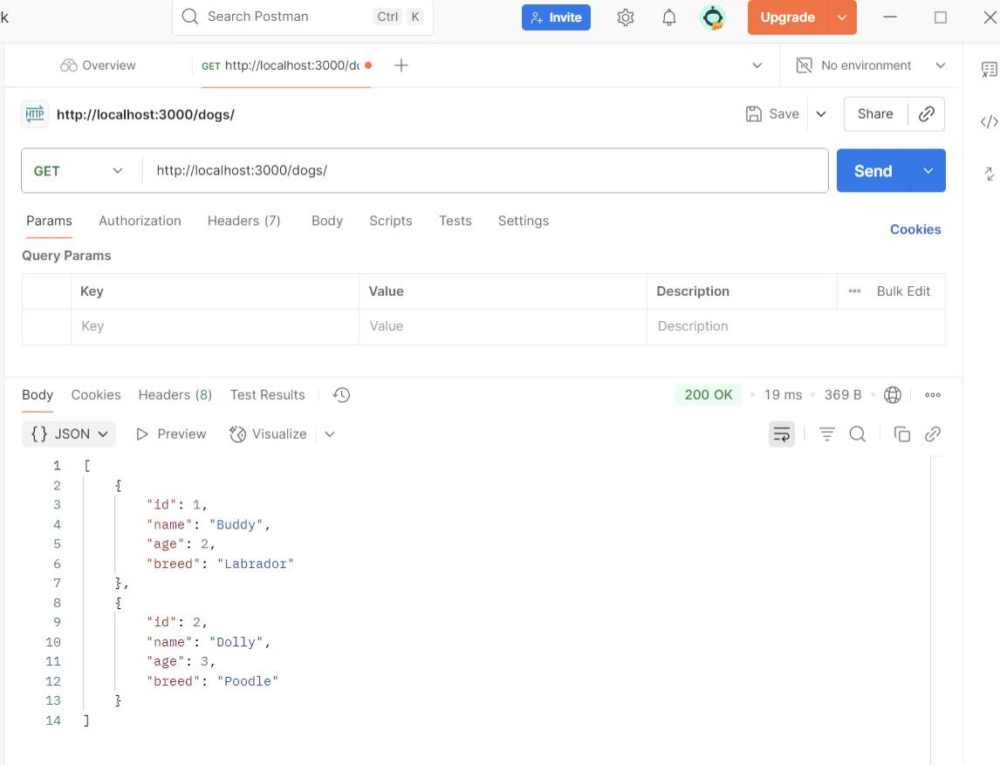

# SB-Exercise-Assessment-16.10-Dog-Adoption-Platform

Springboard SE Bootcamp - Assessment Exercise - 16.10 Dog Adoption Platform

## Important Notes

- To run the server, run `npm run dev`.
- To run the tests, run `npm run test`, which will trigger my integration tests for the endpoints.
- For manual testing with Postman. . . run `npm run dev`, then try hitting any of the endpoints.
  - Note to self: In Postman, you'll need to copy the JWT token generated -> outputted to console.log (you won't see it in Postman), from when you run `http://localhost:3000/user/login`, and pass in a Body: `{ "username": "sampleUser", "password": "samplePassword" }`, for any of the dogRoutes that require the middleware authenticate.
  - To hit protected endpoints - e.g. any from dogRoutes, which require authenticate, you'll need to copy the JWT token from `http://localhost:3000/user/login` into "Bearer Token"
    - 
  - To test the rate limiting endpoint, hit `http://localhost:3000/dogs/registeredDogs?page=2` rapidly - I have it set so the cooldown is 3 seconds, so you should see error 429 till the cooldown has passed and the user record is wiped by setTimeout.
    - 
  - To sum up, dogRoutes API's will require you to have logged-in as per authenticate middleware and pass in either req.body, optional req.query parameters, or required req.param arguments.. Whereas, userRoutes API's will require req.body to get the username and password.
  - WARNING: the `tests` are comparing by ObjectId due to querying by mongoose, so they fail if I do not `.toString()` them... But for my dogController.js - I can compare `originalOwnerId` and `adopterId`, etc. because it's always the `decoded.id` which is a string. Thus, my tests must be stricter in converting them for type-matching.

---

The folder structure designed by our software architects ensures adherence to best practices:

- `controllers`: Contains the logic for handling incoming requests and returning responses to the client.
- `models`: Defines the data models and interacts directly with the database.
- `routes`: Manages the routes of your API, directing requests to the appropriate controller.
- `middlewares`: Houses custom middleware functions, including authentication and rate limiting.
- `.env`: Stores environment variables, such as database connection strings and the JWT secret.
- `app.js`: The main entry point of your application, where you configure the Express app and connect all the pieces.
- `db.js`: Manages the database connection.
- `package.json`: Keeps track of npm packages and scripts necessary for your project.

This structure provides a solid foundation for building a well-organized, scalable backend service. By separating concerns into dedicated directories and files, your project remains clean, navigable, and easier to debug and extend.

View the rubric for this assessment [here](https://storage.googleapis.com/hatchways.appspot.com/employers/springboard/student_rubrics/Dog%20Adoption%20Platform%20Rubric.pdf)

---

Visual Diagram:
Client calls → GET /dogs ← (endpoint)
|
Express sees the request
|
Route says: “for GET /dogs, run getDogs” ← (route)
|
Controller runs the logic ← (controller)
|
Response returned to client

... or TLDR:
OR, super simple:

- Endpoint = the URL the client hits
- Route = the Express connection between URL + function
- Controller = the function that handles the request

---

Connecting it all together:

1. **`app.js`** -> main entry point, sets up express server for HTTP requests and mounts routers.
2. **Router** -> groups related endpoints (like `/dogs`).
3. **Controller** -> handles the actual logic for the endpoint
4. **Middleware** (e.g. `cors`, `express.json`) -> runs before routes, prepares request/response.
5. **Testing** -> doesn't require a frontend... browsers, Postman, Insomnia, or curl can work.

- 
- 
